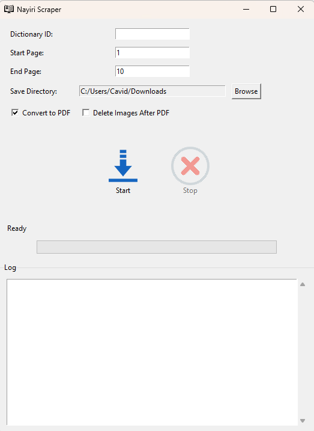

# Nayiri Dictionary Downloader

A desktop application to download and convert dictionary pages from Nayiri.com into PDF format.



## Features

- Download dictionary pages from Nayiri.com
- Convert downloaded pages into a single PDF file
- User-friendly graphical interface
- Progress tracking with status updates
- Option to automatically delete image files after PDF creation
- Customizable page range selection
- Detailed logging of the download process

## Requirements

- Python 3.6 or higher
- Required Python packages:
  - requests
  - beautifulsoup4
  - Pillow
  - fpdf
  - tkinter (usually comes with Python)

## Installation

1. Clone this repository:
```bash
git clone https://github.com/cavidaga/nayiri-downloader.git
cd nayiri-downloader
```

2. Install the required packages:
```bash
pip install -r requirements.txt
```

## Usage

1. Run the application:
```bash
python nayiri_scraper.py
```

2. In the application interface:
   - Enter the Dictionary ID (found in the URL of the dictionary on Nayiri.com)
   - Set the start and end page numbers
   - Choose a directory to save the files
   - Select whether to convert to PDF and/or delete original images
   - Click the "Start" button to begin downloading

### Options

- **Convert to PDF**: When enabled, combines all downloaded pages into a single PDF file
- **Delete Images After PDF**: Automatically removes the downloaded image files after creating the PDF
- **Start Page**: The first page to download
- **End Page**: The last page to download
- **Save Directory**: Where to save the downloaded files and resulting PDF

## Building from Source

To create a standalone executable:

1. Install PyInstaller:
```bash
pip install pyinstaller
```

2. Create the executable:
```bash
pyinstaller --onefile --windowed --icon=icon.ico --add-data "icon.ico;." --add-data "start_icon.png;." --add-data "cancel_icon.png;." nayiri_scraper.py
```

The executable will be created in the `dist` directory.

## Legal Notice

This tool is intended for personal use only. Please ensure you have the right to download and store the dictionary pages before using this tool. Respect Nayiri.com's terms of service and copyright restrictions.

## Contributing

Contributions are welcome! Please feel free to submit a Pull Request.

## License

This project is licensed under the MIT License - see the [LICENSE](LICENSE) file for details.

## Acknowledgments

- Thanks to Nayiri.com for providing valuable Armenian language resources
- Built using Python and Tkinter for the graphical interface
- Uses BeautifulSoup4 for HTML parsing
- Uses FPDF for PDF creation

## Support

If you encounter any issues or have questions, please submit them in the Issues section of this repository.
